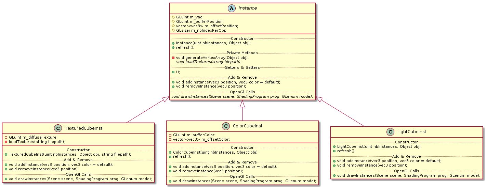
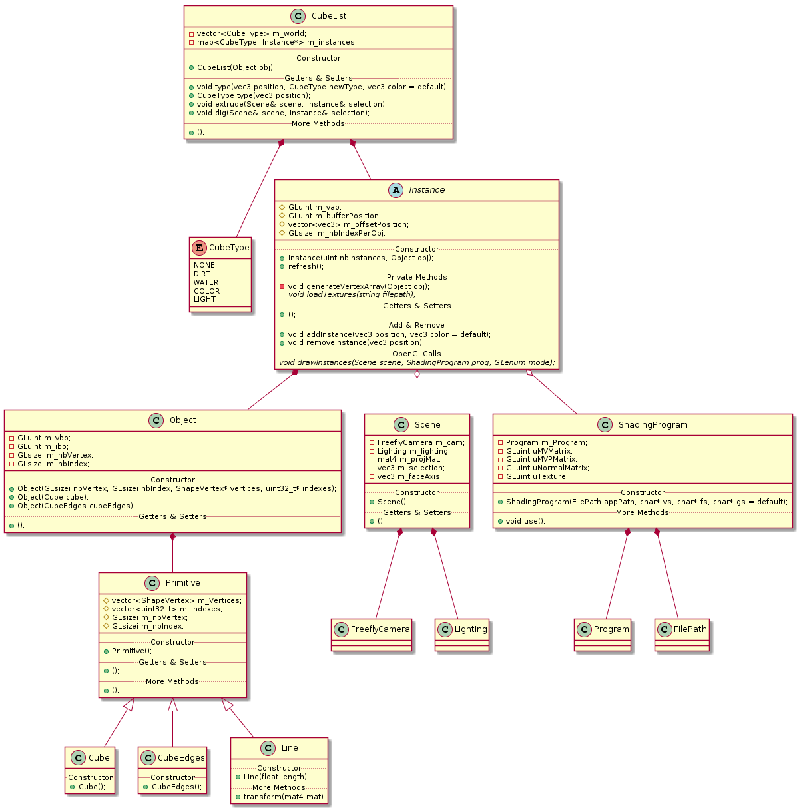

# Naavimac - Project Report

## **LIST OF FEATURES**

### *Required features:*

Feature                    | Done? 
:-------------------:      | :---: 
Drawing a scene with cubes | YES   
Editing cubes (types)      | YES
Create/Delete/Extrude/Dig  | YES
Procedural generation      | NOT YET
Dual light conditions      | YES

### *Optionnal features:*

Feature                            | Done? 
:-------------------:              | :---: 
Improved selection (mouse picking) | YES   
Painting tool                      | NO
Sculpting tool                     | NO
Loading/Saving map                 | NOT YET
Loading 3D Models                  | NO
Spatial discretization             | NO
Textured cubes                     | YES

### *Our features:*

Feature                | Done? 
:-------------------:  | :---: 
Nothing for now

____________________________________
____________________________________
____________________________________

## **FEATURES IN DETAIL**

### **Preamble**:

#### Notes:
In UML drawings, things are a lot simplified. For instance, *Object* and *const Object&* are written the same way because they actually are used the same way.
If you need more details, please take a look at the header files or compile the Doxygen documentation as mentionned in the Readme.

____________________________________

#### Primitive:
We knew we will need several primitives sharing the same attributes (vertices and indexes) so we made a super class Primitive.
This class stores all the required data used to describe a form.
Here is the simple UML hierarchy:


#### Cube Primitive:
The first thing we had to do for this project was to draw a cube with OpenGL.
Because we already knew the cube will be textured, we decided to create it with 24 vertices (4 per face). Of course, as we are doing indexed rendering, we also needed 36 indexes per cube.

Instead of thinking too much about the vertices' position in 3D space and their normals, we decided to create only one face with homogeneous coordinates and then, to use 6 different matrices to place this face in the right space. Then, we just had to push the vertices and indexes attributes inside our cube primitive.


#### CubeEdges Primitive:
For the selection, we wanted to show only the edges of the current selected cube. It looked pretty easy to do by using a simple GL_LINES. But how to deal with its thickness since drawing wide lines (using glLineWidth with a value of more than 1.0) seems to be a deprecated feature, because not supported by every GPU?
The goal is indeed to draw rectangles instead of lines so we decided to try something. After several hours looking for a solution to this problem, testing some unsuccessful things with the vertex shader, we tried to experiment with the Geometry Shader.

**Note:** Geometry Shader is known to be very slow. We use it only for drawing 24 triangles (12 edges).

Here is the idea: 

From 8 points ("real" vertices of the Cube Primitive), we submit 12 lines to the Geometry Shader. It takes the Clip-Space position of both points composing a line. It calculates the direction of the line (simple vector) and its normal. Then, it applies the normal to each point in both "plus and minus" direction to generate two new vertices.


Finally, OpenGL draws two triangles which form the new "line" on the screen.

To be honest, we did not succeed to get exactly what we wanted since the cube corners are straight, the lines make some aliasing and the thickness is not consistent (on the screen) wherever the camera is. However, doing that was an interesting step discovering more and more how the 3D pipeline really works.

#### Line Primitive:
We simply push two vertices in the data array.

____________________________________

#### Object:
The Object Class is really simple. Its goal is to get vertices and indexes data and to push it into the GPU Buffers (creating a VBO and a IBO).

Like this, we can easily create a Cube Object from a Cube Primitive :
```cpp
Object cubeObj = Object(Cube());
```

____________________________________

#### Instance:
The Instance Class is one of the more important. It firstly binds Object Buffers inside a Vertex Array Object. And above all, it defines a new Buffer (vec3 - position in world) sent to the GPU to allow Instanced Rendering.

How to create an instance?
Actually, it is **impossible** because the Instance class is **abstract**.



Indeed, we have to create a *TexturedCube*, *ColorCube* or a *LightCube* instead.

#### TexturedCubeInst:
Here, we have a new OpenGl Id which defines the texture used for the cube.

```cpp
GLuint m_diffuseTexture;
```

To create a TexturedCube:
```cpp
TexturedCubeInst texturedCube(1, cubeObj, "path_to_texture"); // First parameter defines the number of instance, second parameter is the Object "form" we want to draw, third parameter is the path to the image texture
```

Main methods:
```cpp
texturedCube.drawInstances(const Scene&, const ShadingProgram&, GLenum mode); // Draw all the instances
texturedCube.addInstance(const glm::vec3& position); // Add a new position inside the buffer
texturedCube.removeInstance(const glm::vec3& position); // Remove a specific position from the buffer
```


#### ColorCubeInst:
In this one, we define another buffer (vec3 - color) to send into the GPU. Like this, each time the Instanced Rendering is done, shaders take the position and the color corresponding to draw the instances.

```cpp
GLuint m_bufferColor;
std::vector<glm::vec3> m_offsetColor;
```

To create a ColorCube:
```cpp
ColorCubeInst colorCube(1, cubeObj); // First parameter defines the number of instance, second parameter is the Object "form" we want to draw
// Default color is white (1.f, 1.f, 1.f) but we often create the instance with a number of 0 and then we add instances (because there is no Color Cubes on the base map)
```

Main methods:
```cpp
colorCube.drawInstances(const Scene&, const ShadingProgram&, GLenum mode); // Draw all the instances (same as the other one but implementation is different)
colorCube.addInstance(const glm::vec3& position, const glm::vec3& color); // Add a new position and a new color inside the buffers
colorCube.removeInstance(const glm::vec3& position); // Remove a specific position and color from the buffers
```


#### LightCubeInst:
This one is very simple because it represents a simple white cube.
We could use the ColorCubeInst to draw this one but we did not need another buffer storring color data because they are all white. So, it is just a concrete representation of the Instance abstract class.

To create a LightCube:
```cpp
LightCubeInst lightCube(1, cubeObj); // First parameter defines the number of instance, second parameter is the Object "form" we want to draw
```

Here, the method prototypes look the same as the TexturedCube methods.

____________________________________
____________________________________


### **Drawing a scene with cubes**:
Now, we know how to draw several cubes. Great! We still need to deal with the different types of cube. The idea is pretty simple, let's take a look at the CubeList class!

```cpp
enum CubeType {
    NONE, DIRT, WATER, COLOR, LIGHT
};

class CubeList {
    private:
        std::vector<CubeType> m_world;
        std::map<CubeType, std::shared_ptr<Instance>> m_instances;

        // Some other privates methods we do not care here...

    public:
        CubeList(const Object& obj);
        ~CubeList() = default;

        void type(Scene& scene, const glm::vec3& position, const CubeType& newType, const glm::vec3& color = glm::vec3(1.f,1.f,1.f)); //Setter
        const CubeType type(const glm::vec3& position) const; //Getter

        void extrude(Scene& scene, Instance& selectionInst);
        void dig(Scene& scene, Instance& selectionInst);
};  
```

To define the type, we use an enum. We thought using a strategy design pattern but it was not very appropriate in this context.

The Class has two member attributes: 
- **m_world** is a simple array of CubeType. It describes every single cube in the world (even non existing cubes). Like this, we can instantly know what is the CubeType corresponding of a specific position (dealing with a bit of index-position conversion behind it). If there is no cube, the CubeType is : NONE.

- **m_instances** is a map of Instance pointers (smart pointers, to be accurate). The key to find the good instance is the CubeType corresponding. Like this, we have as many instances as CubeTypes (minus one because of the NONE type).

Why doing this way? *2 reasons:*
- Let us imagine the world is very big but only a few cubes are really drawn, it would take a lot of memory to have a structure containing a position (vec3) AND a type for each single possible cube of the world since only a few ones are really existing. Doing as we do already takes a lot of memory and time to make it in place. However, we can immediately access the type of each cube.
- To make the Instanced Rendering work, we need to send the position of the specific cubes in a buffer. So, having several arrays (one per type) ready to be sent to the GPU is essential.

Here is the collaboration UML drawing of the CubeList Class:



When the CubeList is created, the DIRT Instance is filled with 3 layers of cubes (by default). These layers stand in the middle of the world (between -1 and 1 on the Y axis).
Indeed, the world stretches around the (0, 0, 0) point from -size/2 to +size/2 on each axis.

____________________________________
____________________________________


### **Editing cubes (types)**:
To select a specific cube, we have a cursor (selection). This one is done thank to the CubeEdges primitive. Like this, we can only show the edges of the selected cube.
Unfortunately, the cursor is not always visible. We wanted to make a "X-Ray" view (like in Blender, for instance) to make it be visible everywhere but we did not have the time to succeed on this task. Of course, we could just "disable depth" and draw the cube at the end, but it was a bit weird to see the cursor when we are not supposed to see it...

Then, changing the type of a specific cube is pretty easy: we just need to call the type() method. 
```cpp
void CubeList::type(Scene& scene, const glm::vec3& position, const CubeType& newType, const glm::vec3& color) {
    //Check if the position is effectively inside the world (normally yes because selection is restricted to this area)
    if(position.x >= worldMinX && position.x <= worldMaxX && 
        position.y >= worldMinY && position.y <= worldMaxY && 
            position.z >= worldMinZ && position.z <= worldMaxZ) {

                int index = indexFromPosition(position); //Get corresponding index
                CubeType oldType = m_world[index]; //Get the current CubeType
                size_t nbLights = scene.lighting().nbLights(); //Get the number of lights in the world

                if(newType == LIGHT && nbLights >= nbLightsMax) return; //Return if we want to make a light while we already have the max number of lights
                if(oldType != COLOR && newType != COLOR && oldType == newType) return; //Return if oldType and newType are the same (except for COLOR)

                m_world[index] = newType; //Update the world array

                if(oldType != NONE) m_instances.at(oldType)->removeInstance(position);
                if(oldType == LIGHT) {
                    scene.changeLighting().removeLight(position); //Remove also a light from the uniform array
                }

                if(newType == COLOR) {
                    m_instances.at(newType)->addInstance(position, color); //Change color of the cube
                    return;
                }
                if(newType != NONE) m_instances.at(newType)->addInstance(position);
                if(newType == LIGHT) {
                    scene.changeLighting().addLight(position); //Add also a light to the uniform array
                }
    }
}
```
This function is quite big and we could break it down a little bit.
____________________________________
____________________________________


### **Create/Delete/Extrude/Dig**:
These functions are directly linked to the CubeType. Indeed, to **Create** a cube, we simply change its type from *NONE* to *SOMETHING* and vice-versa to **Delete** a cube.

**Extrude** and **Dig** use the **Create** and **Delete** functions to work. We did not really understand the goal of these functions since we can create or delete any cube, anywhere. So we thought, they are tools to make the world building easier/faster.

Starting from there, we used our Mouse Picking Selection (see later) to chose the axis to work on. Like this, when we click on one cube's face, we deduce the normal of the selected face and so, the axis we want to work on for adding or removing cubes. As explained in the Mouse Picking Selection part, we used a hacky non-accurate method to make it works (with a lot of round numbers).

____________________________________
____________________________________


### **Procedural generation**:
TO DO !


____________________________________
____________________________________


### **Dual light conditions**:
To deal with lighting, we use a class called Lighting!

```cpp
class Lighting {
    private:
        //Sun attributes (directional light)
        glm::vec3 m_sunLightDir = glm::vec3(1, 1, 0);
        glm::vec3 m_sunLightInt = glm::vec3(1, 1, 1);

        //Points attributes (point lights)
        std::vector<glm::vec3> m_pointLights;
        glm::vec3 m_pointLightsInt = glm::vec3(5, 5, 5);

    public:
        //METHODS
}
```

In our application, we can switch from night to daylight. We simply send a different sunlight intensity to our shader which makes a **Directional Blinn-Phong** operation on our cube's fragments.

```cpp
void Lighting::activateSun();
void Lighting::deactivateSun();
```

By default, there is no point lights in the world but you can add it until 5! Indeed, because we are using an uniform array to send light positions, we need to specify the max number of lights (it cannot be too high, so we chose 5).

We tried to use Texture1DArray to pass many more lights to the shader but it was not functionnal. We also gave a look to *Deferred Shading* but we did not have enough time to experiment with it.

____________________________________
____________________________________


### **Improved selection (Mouse Picking Selection)**:
To allow the mouse selection, we did some cheating OpenGL hacks.
The idea is very simple and absolutely not optimized:

When we press the Right Mouse Button, we draw the scene a first time but with smaller cubes (just a bit smaller, we will see later why) and we transform the Mouse coordinates from Screen Space to World Space. To get the appropriate depth, we use the glReadPixels function. We should use a FrameBuffer Object to optimize.

Like this, we have floating points coordinates, so we make them round.
Then, we check if the current position in World Space corresponds to a not-NONE cube. If so, we update the position of the selection to this cube. If not, we calculate a new position in the same direction (camera/mouse) and we arbitrarily place it 10 cubes in "front" of the camera.

Now, why drawing smaller cubes?

The normal way to do that kind of mouse picking object is to attribute a different color to each object and to get the color picked by the mouse to retrieve the corresponding object. Pretty simple.
BUT since we do not draw our cubes from only one buffer, it is more complicated to give to each object a specific color (often based on an ID). It is possible to generate a color from the cube position but it seems to be quite limited (maximum of 256^3 cubes??).

So doing the way we do, it works pretty well and it is pretty easy to understand. The only problem comes with the depth value. Sometimes, where you expect something like 1.500 or less, you get 1.504 and it makes the round operation wrong. The cube selected is not the good one. The solution is to draw the cubes just a bit smaller and like this, the round operation works well every time (because the faces of the cube are closer to the gravity center).

**Note:** if we hold the Right Mouse Button and move the Mouse, the selection will move too following the main axis of the motion. The main axis is calculated thank to the *upVector* and the *leftVector* of the camera. The control is not perfect for a lot of reasons but it does work.

____________________________________
____________________________________

### **Loading/Saving map**:
Yes, no, maybe? I don't know... 


### **Textured cubes**:
Actually, it is not hard stuff. We made a very simple implementation using only one texture (a diffuse map). We load it and simply send it to OpenGL. In the Fragment Shader, we calculate the fragment's color using the texture and the lights! 

To make it more complex and improve the realism, we should use several maps (glossy, reflection, etc) and do some multi-texturing. 

____________________________________
____________________________________
____________________________________

## **DIFFICULTIES**

What was pretty difficult during this project is to understand how the 3D pipeline works (and we still have a lot to learn). The main difficulty is **time**. It took a lot of time to fix problems, to discover better way to develop a functionnality, etc. We are still learning so, at the beginning of the project, there were a lot of unknowns. We changed a lot the software architecture because we are inexperienced with these notions.

____________________________________
____________________________________
____________________________________

## **INDIVIDUAL FEELINGS**

Julien:
> I learned a lot doing this project. It was very interesting and I discovered many ressources I want to dive deeper in. This project was a pretty good introduction to 3D programming. Now, I want to restart from scratch, to make something some consistent and to work on optimizing ways. Every error I made during this project permitted me to better understand how we should start a project like this one and the kind of knowledges required.